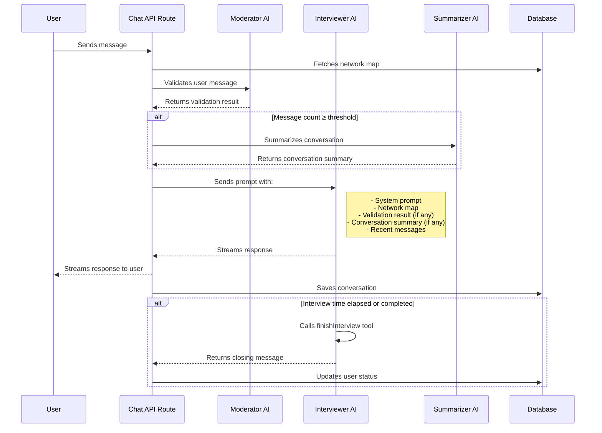

# Student-Centered Collaboration Research Project

This application is part of a research study exploring how users engage in interviews about their social connections—either with a chatbot or with a human peer. The study "Network." is conducted by Marco Galle from [PH Luzern](https://www.phlu.ch/) with technical support by [smartive AG](https://www.smartive.ch/).

## Overview

The key user flow includes:

1. Receiving an email link containing an access key to determine user group (chatbot interview, human interview, or test group).
2. Viewing an introductory video and consenting (or declining) to participate—data is only recorded upon consent.
3. Completing an initial questionnaire.
4. Viewing a tutorial video and building a personal social network map.
5. Depending on the assigned group:
   - Human Interview: The user participates in an audio-recorded discussion with a peer.
   - Chatbot Interview: The user has a ~10-minute conversation with an AI chatbot about their social network.
6. Filling out a final questionnaire reflecting on their experience.
7. Optionally downloading their network map as an pdf.

All gathered data (consent, questionnaire responses, network maps, interview recordings/transcripts) is stored securely in a PostgreSQL database or Google Cloud Storage.

## Tech Stack

- React 19
- Next.js 15 (using the App Router)
- TypeScript
- Tailwind CSS
- Shadcn/UI and Radix UI for components
- Vercel AI SDK (Azure OpenAI model integration)
- PostgreSQL

## Project Structure and Features

- Uses Next.js App Router for structured pages and route handlers.
- Includes server-side and client-side components for optimized performance and fast rendering.
- Implements AI-driven chatbot interviews via the Vercel AI SDK, with streaming responses and context management.
- Stores conversation transcripts, questionnaire data, and network mapping data in PostgreSQL.
- Provides an audio recording feature for the human interview flow with file storage in Google Cloud Storage.
- Offers a final download option for the user's network map.
- Enforces minimal back-navigation to ensure data integrity.

## AI Chatbot Orchestration

The application uses a multi-model AI system to handle user interactions during the interview process. The diagram below illustrates how different AI components work together to process user input:



This orchestration enables:

- Content moderation, safety and preventing of topic drift through the Moderator AI
- Contextual awareness through the Summarizer AI (which preserves context while managing token limits)
- Structured and natural conversation flow through the Interviewer AI

## Getting Started

### Prerequisites

- Node.js (20+ recommended)

### Development Server

1. Clone the repository.
2. Install dependencies:
   ```bash
   npm ci
   ```
3. Create a `.env` file with the necessary environment variables (see `.env.example` for reference).
4. Run the development server:
   ```bash
   npm run dev
   ```
5. Open [http://localhost:3000](http://localhost:3000) in your browser to view the application.

### Data Export

A script is available to export all collected user data from the database and Google Cloud Storage into a local directory structure.

1.  **Ensure Environment Variables are Set**: The script requires the same database connection (`INSTANCE_CONNECTION_NAME`, `POSTGRES_*`) and Google Cloud Storage (`GCP_*`) credentials in your `.env` file as the main application.
2.  **Run the Export Script**:
    ```bash
    npm run export:data
    ```
3.  **Output**: This command will create an `exports` directory in the project root. Inside `exports`, you will find a sub-directory for each user (named with their `user_id`), containing:
    - `network_map_and_questionnaires.xlsx`: Data from the network map and the two questionnaires.
    - `chat_transcript.txt`: Full transcript for users in the 'chatbot' group.
    - `interview_audio.webm`: Downloaded audio recording for users in the 'human' group (if available).

## License

This project is licensed under the MIT License - see the [LICENSE](./LICENSE) file for details.

This research project is funded by public resources and is intended to serve as a public good. The MIT License was chosen to maximize accessibility and reuse while maintaining basic attribution requirements.
